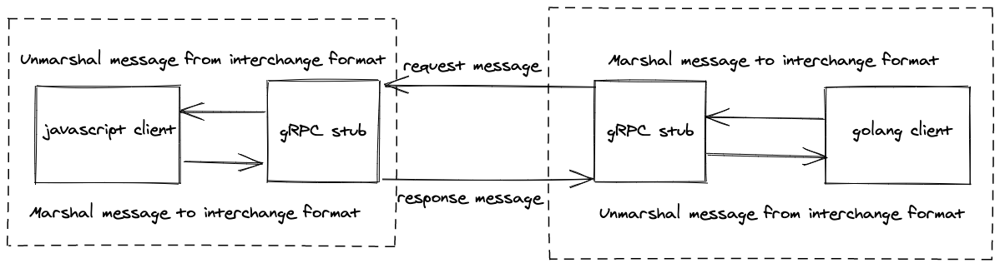
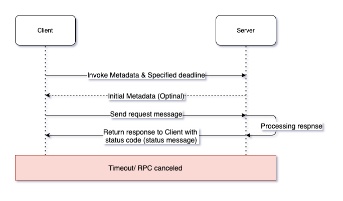
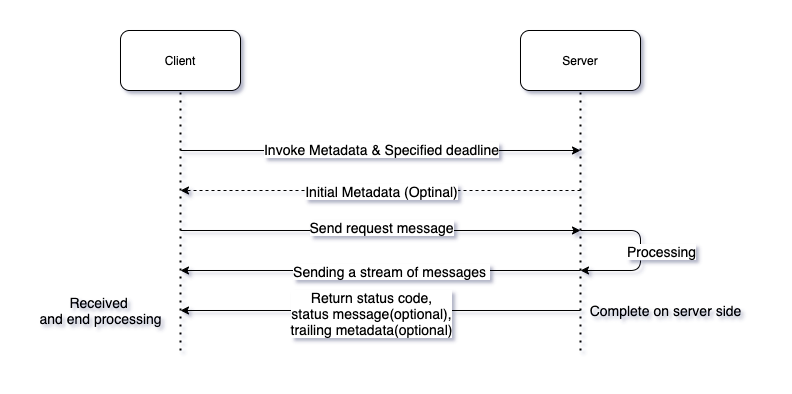
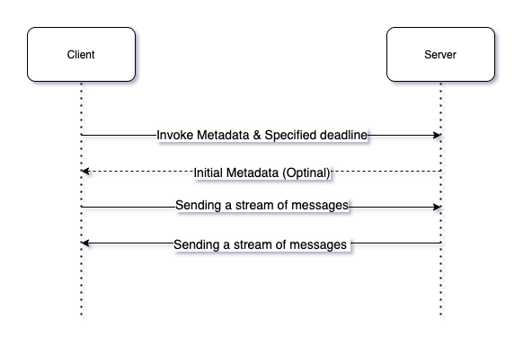

## A quick introduction about gRPC and proto buffer

### What is gRPC?

**gRPC** is an **PRC library and framework** which is modern, open source, high performance, and can run anywhere.

PRC is stand for 'Remote Procedure Call', it enables call functions directly between difference programs over network. You can see the caller is a client and the executor as a server. RPC is a request-response protocol, that the client sends a request message to the server to execute the procedure with given data, then the server process the data and return to client the response message.

In gRPC, it defines services, specifying the methods of these services, then define the request message and the response message for each method. The Interface Definition Language (IDL) is used to define the format of these service, by default gRPC use proto buffer as its default IDL. When we build the server, we must implement the services interface and run RPC server to handle client requests. And the client will call the client stub, which will marshal the message and send to the server. The gRPC clients and servers can run and talk to each other in variable environments.



### Proto buffer

Proto buffer is an Interface Definition Language, it provides mechanism for serializing structured data.
In proto buffers to serialize/deserialize an object, that object must be defined as a message.
This is an example of proto buffers message.

File `address_book.proto`

```proto
syntax = "proto3";
package tutorial;

import "google/protobuf/timestamp.proto";

message Person {
  string name = 1;
  int32 id = 2;  // Unique ID number for this person.
  string email = 3;

  // Enumerations
  enum PhoneType {
    MOBILE = 0;
    HOME = 1;
    WORK = 2;
  }

  // Nested message defined inside other message
  message PhoneNumber {
    string number = 1;
    PhoneType type = 2;
  }

  repeated PhoneNumber phones = 4;
  google.protobuf.Timestamp last_updated = 5;

  // Reserve ids and field names for future using
  reserved 6, 7, 8, 10 to 12; // these ids cannot used, until it has been removed from this list
  reserved "company", "country"; // also for these field names
}

// Our address book file is just one of these.
message AddressBook {
  repeated Person people = 1;
}
```

The first line tell the syntax of the proto buffers, `proto3` is a newest version now.

Then, package define name space of for all messages and services in this file.

And we also want to import for the service or message for others namespace. For example,
I import package `google/protobuf/timestamp.proto` to using the extra type `google.protobuf.Timestamp`.

The `Message Type` is a struct contains others type can be [Scalar Value Types](https://developers.google.com/protocol-buffers/docs/proto3#scalar)
or [Enums](https://developers.google.com/protocol-buffers/docs/proto3#enum), even others `Message Type` nested inside.
Each field defined in message with key-value structured, and identified by a unique id.

In the example above, the fields name, id, email are scalar type, the standard simple data
types are including bool, int32, float, double, and string.

We can define a message nested under other
message as you can see here the `PhoneNumber` is defined inside the `Person`.

When you want specific values for a field, you can declare them as an enum, the PhoneType tell
that it value can be one of MOBILE, HOME, or WORK.

A field also can repeat any number of times (like a dynamic array), like people in the `AddressBook`.

The = 1, = 2 on each elements is unique ids that identify the field in binary encoding.

NOTE: The id of fields is more far important than the name, because it tell the
position of field's value when marshal/unmarshal message.
If you have been using the proto message for production, don't re-use the id of old field,
mark themes as deprecated and using new one.

## gRPC core concepts, architecture and life circle

### Core concepts

## Service definition

gRPC is based on the main ideal of RPC that define the service. By using proto buffers
(or any IDL you want), you can define how the client and server acting. For proto buffers,
you can have 3 kinds of connections:

- Unary RPC: Client send a request message and server with return a response message.
- Server streaming RPCs: Client send a request message and server will return multiple message.
  Client will be waiting still no more message returned from the server.
- Client streaming RPCs: Client can send multiple requests and server will listen
  until then client done with sending message, and after that the server returns a response message to client.
- And bidirectional streaming RPCs: both server and client will send and receive message independently.
  That means, the server and client can process and send data in whatever they want, non-blocking.

And gRPC will always guarantee the ordering of the messages.

For example, I will define and gRPC service for the sending and receive messages

```protobuf
service ChatService {
    rpc Single(ChatMessage) returns (ChatMessage);
    rpc ListenMultiMessages (ChatMessage) returns (stream ChatMessage);
    rpc SendMultiMessage (stream ChatMessage) returns (ChatMessage);
    rpc BidiSendAndRecv (stream ChatMessage) returns (stream ChatMessage);
}

message ChatMessage {
    int32 id = 1;
    string message = 2;
}
```

### Life circle

#### Unary RPC

1. When client calls a stub method, the server is received the initial data, this
is including the client's Metadata, method name, and the deadline (timeout) for this call.

2. Then, the server can return its initial Metadata too, or just wait for the client
message.

3. At this time, client can send the message to server, and waiting for the response.

4. After received message from client, server process for this request then send back
to client.

5. Client will wait for the response in specific time called "Deadline",  and client
will waiting until it received response message, or server cancelling RPC.



#### Sever/Client streaming RPC

A server/client streaming RPC is quite similar to Unary one, but instead of send
or received one message per RPC call, the server/client will send a process multiple
message within single call.



#### Bidirectional streaming RPC

By using bidirectional streaming RPC, the client and the server has created two
independent message stream, so that client and server can send and receive messages
in whatever order they want.



#### Deadline/Timeouts

Deadline/Timeouts is contract of the client when it's making a request, and client
will wait for an RPC complete before this time or it will terminate with a `DEADLINE_EXEEDED`
error. On server side, its can also check for the client's deadline to check if this
RPC has timeout, or how much time left for done its job.

#### RPC Termination

Both the server and client can make a local termination of the RPC call. This was mean,
client can complete process before client sends all of its requests.

#### Metadata

Metadata is information about a single RPC call, (such as timeout, authentication
details), in form of key-value pairs, the keys are string but the value can either string
or binary data.

#### Channels

A gRPC channel provides a connection between client and server on specific host
and port. Stubs are created by create channels, and clients can specify channel
arguments to modify gRPC's default behaviors. A channel has two state `connected`
and `idle`.

## Last words

When you want to build robust micro-services system or high-performance API, is gRPC
one of the best choice for you because the stubs performance, high compressed data
when sending message (using protobuf), and allow streaming.

This is my first blog, and I hope you have good experience here.
Thank you, and see you in next post.
